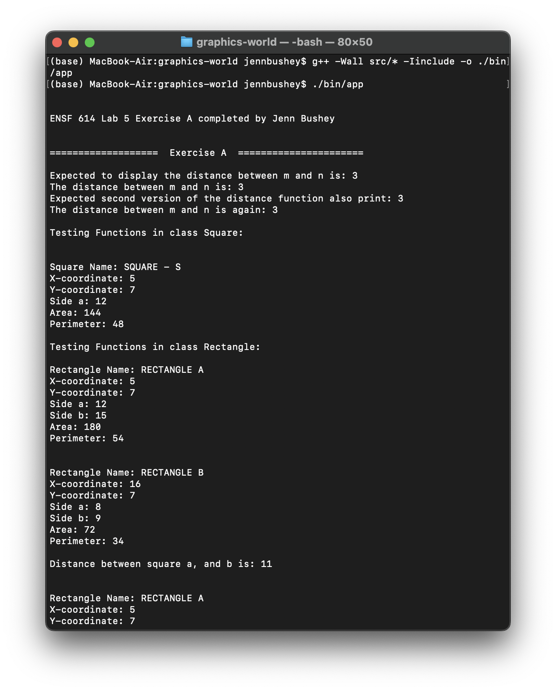
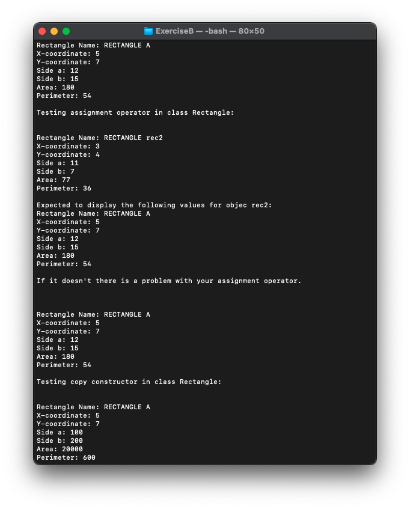
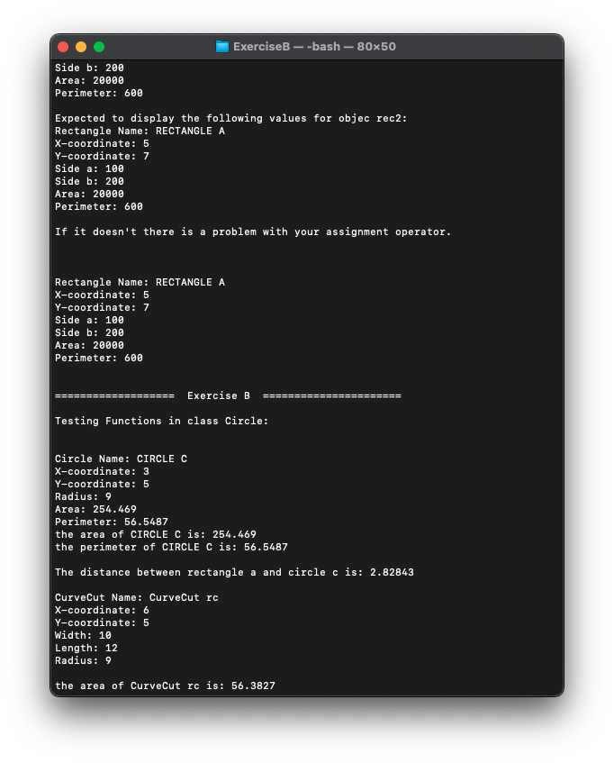
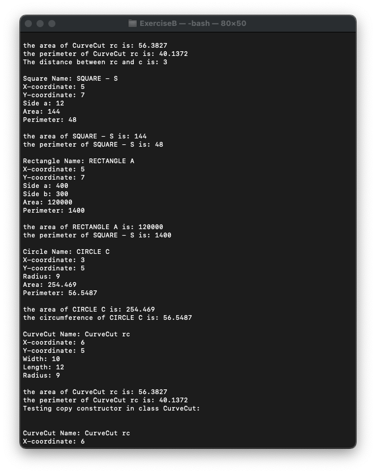
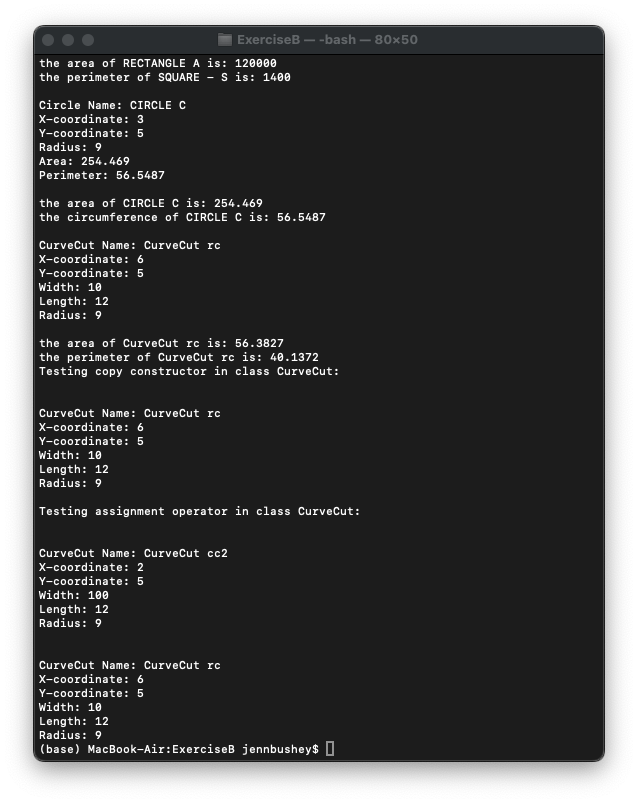

# Graphics World

The concepts of aggregation, composition, and inheritance in C++ and Java in terms of concepts are similar, but they are
completely different in terms of implementation and syntax. Also, another major difference between the two languages is that
C++ unlike Java supports multiple-inheritance.

In this exercise, first you will write the definitions of following classes: Point, Shape, Rectangle, Square, GraphicsWorld, Circle, and CurveCut as explained below.

**Class Point:**
This class is supposed to represent a point in a Cartesian plane. It should have three data members: x, and y coordinates and an id number that its value will be assigned automatically. The first object’s id number should be 1001, second one should be
1002, and so on. Class Point should also have at least the following member functions:

-   display - that displays x, and y coordinates of the point in the following format:

        X-coordinate: ######.##
        Y-coordinate: ######.##

-   A constructor that initializes its data members.
    Note: You are not supposed to define a default constructor in this class. Automatic calls to the default constructor
    will hide some of the important aspects of this assignment (marks will be deducted if you define a default
    constructor for this class).
-   Access functions, getters and setters, as needed.
-   Function counter()that returns the number of objects of class Point at any time.
-   Two distance functions that return the distance between two points. One of the two must be a static function.

You should create two files for this class: called point.h and point.cpp

**Class Shape:**
This class is the base class or the ancestor of several classes, including class Rectangle, Square, Circle, etc. It should support
basic operations and structures that are common among the children of this class. This class should have an object of class
Point called origin, and a char pointer called shapeName that points to a dynamically allocated memory space,
allocated by the class constructor. This class should also have several functions and a constructor as follows:

-   A constructor that initializes its data members.
-   No default constructor
-   A destructor that de-allocates the memory space allocated dynamically for shapeName
-   getOrigin – that returns a reference to point origin. The reference should not allow the x and y values of point to be
    modified through this reference.
-   getName – that returns the name of the shape.
-   display – that prints on the screen the shape’s name, x and y coordinates of point origin, in the following format:

        Shape Name:
        X-coordinate:
        Y-coordinate:

-   two distance functions

        double distance (Shape& other);
        static double distance (Shape& the_shape, Shape& other);

-   move: that changes the position of the shape, the current x and y coordinates, to x+dx, and y+dx. The function’s
    interface (prototype) should be;
    void move (double dx, double dy);

You should create two files for this class: called shape.h and shape.cpp

**Class Square:**
This class is supposed to be derived from class Shape, and should have one data member, called side_a, and in addition to
its constructor should have a constructor and several member functions as follows:

-   One constructor that initializes its data members with its arguments supplied by the user.
-   No default constructor. Marks will be deducted if a default constructor is defined for this class
-   area – that returns the area of a square
-   perimeter: that returns the perimeter of a square
-   get and set - as needed.
-   display – that displays the name, x and y coordinates of the origin, side_a, area, and perimeter of a square object in the
    following format:

            Square Name:
            X-coordinate:
            Y-coordinate:
            Side a:
            Area:
            Perimeter;

-   More Functions, if needed.
    You should create two files for this class: called square.h and square.cpp
    Class Rectangle:
    Class Rectangle that is derived from class Square needs to have one more side called side_b. This class, in addition to its
    constructor (no default constructor), should support the following functions:
-   area – that calculates and returns the area of a rectangle
-   perimeter – that calculates and returns the perimeter of a rectangle
-   get and set – that retrieves or changes the values of its private data members.
-   display – that displays the name, and x and y coordinate origin of the shape, side_a, side_b, area, and perimeter of a
    rectangle object, in the following format:

            Rectangle Name:
            X-coordinate:
            Y-coordinate:
            Side a:
            Side b:
            Area:
            Perimeter;

-   More Functions, if needed.

You should create two files for this class: called rectangle.h and rectangle.cpp

**Class GraphicsWorld:**
This class should have only a function called run, which declares instances of the above-mentioned classes as its local
variable. This function should first display a short message about the author(s) of the program and then start testing all of the functions of the classes in this system. You are recommended to use conditional compilation directives to test your code (one class at a time).

You should create two files for this class: called graphicsWorld.h and graphicsWorld.cpp

**Class Circle:**
This class is supposed to be derived from class Shape, and should have a data member radius, and in addition to its
constructor it should support the similar functions as class Rectangle, such as area, perimeter, get,
set, and display.

You should create two files for this class: called circle.h and circle.cpp

**Class CurveCut:**
This class represents a shape that needs properties of class Rectangle and class Circle. In fact it’s a rectangle that
its left top corner can have an arch-form cut (see the following picture).
This class must be derived from class Rectangle and class Circle. Where the origins (x and y coordinates) of both
shapes are the same. This class in addition to a constructor should support the following functions:

-   area – that calculates the highlighted area of the above figure.
-   perimeter – that calculates and returns the perimeter of highlighted areas.
-   display – that displays the name, x, y coordinates of origin of the shape, width and length (as shown in the
    picture above), and radius of the cut, in the following format:

            CurveCut Name:
            X-coordinate:
            Y-coordinate:
            Width:
            Length:
            Radius of the cut.

Note: The radius of the circle must be always less than or equal the smaller of the width and length. Otherwise,
program should display an error message and terminate.
You should also add some code to function run in class GraphicsWorld to:

-   test the member functions of class CurveCut.
-   use an array of pointers to Shape objects, where each pointer points to a different object in the shapes
    hierarchy. Then test the functions of each class again.

### Program Output

